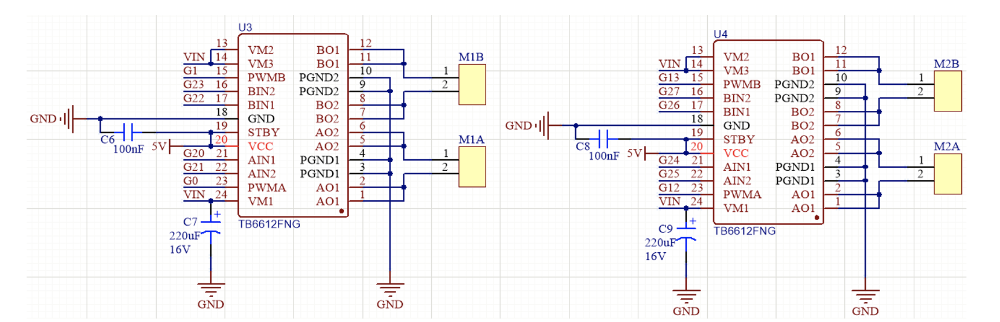

# Bumble

Base OS Build

1. Raspberry Pi Imager for Mac OS - https://www.raspberrypi.com/software/
2. Virtual Desktop for Mac OS to connect to Raspberry PI - https://www.realvnc.com/en/connect/download/viewer/
3. Raspberry PI OS (Bookworm 64-bit) - Installing Desktop version for starters, may change to headless later on
4. Customisation notes :
   1. Username: ######
   2. Password: ######
   3. local DNS address: #####.local
   4. Connected to ###### SSID
   5. An SSH key also set (####)

## Booting Bumble for first time

1. Power up with USB C.
2. SSH into raspberry pi and update packages

```sh
$ ssh <username>@<hostname>.local
$ sudo apt update
$ sudo apt upgrade
```

3. Installing and enabling VNC Server on Raspberry PI for remote desktop viewing

```sh
$ sudo apt install realvnc-vnc-server realvnc-vnc-viewer
```

4. Interface Configuration for VNC. From Raspi Configuration window, select and enable VNC.

```sh
$ sudo raspi-config
# select I3 VNC
```

5. Enable I2C on raspberry pi so that we can use I2C interface for our peripherals, e.g., the OLED module.

```sh
$ sudo raspi-config
# selct I5 I2C
```

6. Setup virtual python environment

```sh
$ sudo apt install virtualenvwrapper
$ mkdir .virtualenvs

# if having difficulties locating the folder where virtualenvwrapper was installed
$ cd /
$ sudo find -iname "virtualenvwrapper.sh"

# Add the following to .bashrc
export VIRTUALENVWRAPPER_PYTHON=/usr/bin/python3
export WORKON_HOME=$HOME/.virtualenvs
export VIRTUALENVWRAPPER_VIRTUALENV=/usr/bin/virtualenv
source /usr/share/virtualenvwrapper/virtualenvwrapper.sh

# create virtualenv
$ mkvirtualenv bumble
```

6. Setup python bindings for Raspberry PI GPIO

```sh
# Inside bumble virtual env
$ pip install RPi.gpio
```

## Development Platform Setup

1. Python virtual environment setup

```sh
$ pyenv shell 3.12.4
$ pyenv virtualenvwrapper
$ mkvirtualenv bumble
```

2. Installing Mock Raspberry PI GPIO library

```sh
pip install Mock.GPIO
```

## Bumble CLI - Command Line Interface

A command line interface is integrated in the code base for component testing on the Raspberry PI. To deploy the code base and install the binary as a CLI interface, follow the instructions below.

### Deploying the code on Raspberry PI

1. Clone the repository on your development platform.

```sh
$ git clone https://github.com/hasnainvirk/Bumble.git
```

2. Deploy code base and install bumble CLI using script.

```sh
# from the root of your repo, make sure script is executable
$ chomod +x deploy.sh
$ ./deploy.sh
```

The script SSHs into raspberry PI, clones the git repo, and installss the CLI binary. It then runs a command `$ bumble --help` which shows the help page for CLI.

More detailed help can be checked, e.g.,

```sh
$ bumble oled --help
Usage: bumble oled [OPTIONS]

Options:
  -text                     Loads text on the OLED screen
  -image TEXT               Loads an image on OLED screen. The image should be
                            in resources folder, e.g. $bumble oled --image
                            grumpy_cat.jpg
  -emoji [happy|sad|angry]  Loads an emoji the OLED screen, e.g. $bumble oled
                            --emoji happy
  -stats                    Loads usage states on the OLED screen
  -v                        Verbosity level default=error, v=info, vv=debug
  --help                    Show this message and exit.
```

## Testing Components

### OLED Panel

- 0.96 inch OLD module driven by I2C (Chip SSD1306)
- Resolution: 124x64 pixels
- Code Reference: https://github.com/adafruit/Adafruit_CircuitPython_SSD1306

```sh
#Installing SSD1306 driver library dependency
$ pip install adafruit-circuitpython-ssd1306
```

#### Testing Text

OLED screen shows example text in 4 rows.

```sh
$ bumble oled -text
```

#### Testing Image

OLED screen shows 1-pixel converted image of an image that is placed in `./component_testing/oled/modules/resources`, e.g.,

```sh
$ bumble oled -image grumpy_cat.jpg
```

#### Testing Emoji

OLED screen shows an animated happy emoji, e.g.,

```sh
$ bumble oled -emoji happy
```

Other options are `sad` and `angry`

#### Testing Stats

OLED screen shows utilization statistics of CPU. RAM and Disk, e.g.,

```sh
$ bumble oled -stats
```

## Wheels

The motors that move the wheels are connected to TB6612 motor driving chips. There are two of these chips located on the control shield that sits on top of the Raspberry PI. Here are the schematics:



| Wheel      | Motor name on schematics | Motor name on the board | R.PI GPIO PIN & Pull                    | Direction | speed (PWM) |
| ---------- | ------------------------ | ----------------------- | --------------------------------------- | --------- | ----------- |
| UpperLeft  | M1A                      | M2                      | GPIO_20 pulled Low, GPIO_21 pulled High | forward   | GPIO_0      |
| LowerLeft  | M1B                      | M1                      | GPIO_22 pulled High, GPIO_23 pulled Low | forward   | GPIO_1      |
| UpperRight | M2A                      | M3                      | GPIO_24 pulled High, GPIO_25 pulled Low | forward   | GPIO_12     |
| LowerRight | M2B                      | M4                      | GPIO_26 pulled Low, GPIO_27 pulled High | forward   | GPIO_13     |
